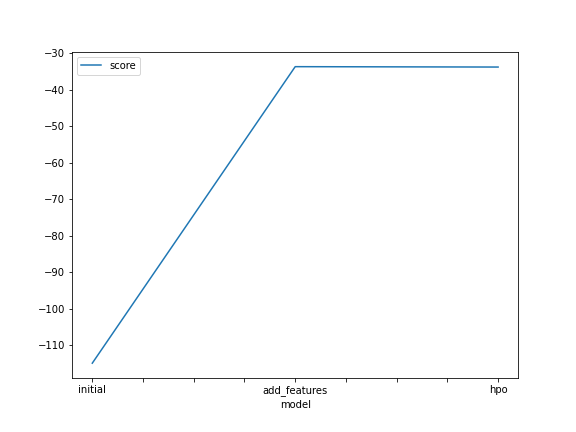
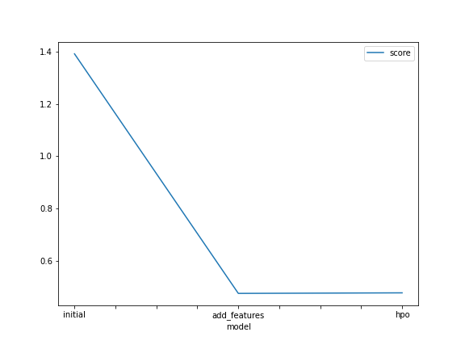

# Report: Predict Bike Sharing Demand with AutoGluon Solution
#### Vivek Raj

## Initial Training
### What did you realize when you tried to submit your predictions? What changes were needed to the output of the predictor to submit your results?
If we do not set everything to be > 0, then kaggle will reject our submission. Therefore I have updated the negative values to be zero.

### What was the top ranked model that performed?
WeightedEnsemble_L3

## Exploratory data analysis and feature creation
### What did the exploratory analysis find and how did you add additional features?
Got a better understanding of the features
Binary variables: holiday, workingday
Variable approx normally distributed: temp, atemp
Right skewed variables: windspeed, causal, registered, count
datetime variable could be informative because hypothetically day of the week and time of the day are factors that could impact bike sharing demand.
Therefore, I extracted the following variables from datetime:
Month
Day of week
hour of day

### How much better did your model preform after adding additional features and why do you think that is?
RMSE dropped from 1.38656 to 0.44563.
Because by adding those new features, the model is able to utilize the information previously buried under datetime variable and make more accurate predictions.

## Hyper parameter tuning
### How much better did your model preform after trying different hyper parameters?
After trying different hyperparameters (time, num_stack_levels, num_bag_folds), my model didn't perform better.

### If you were given more time with this dataset, where do you think you would spend more time?
I would probably spend more time tuning time_limit/num_stack_levels/num_bag_folds.

### Create a table with the models you ran, the hyperparameters modified, and the kaggle score.
|model|hpo1|hpo2|hpo3|score|
|--|--|--|--|--|
|initial|992.35|NaN|NaN|1.38656|
|add_features|596.69|NaN|NaN|0.46625|
|hpo|1950.42|5.0|2.0|0.44563|

### Create a line plot showing the top model score for the three (or more) training runs during the project.

TODO: Replace the image below with your own.

### Create a line plot showing the top kaggle score for the three (or more) prediction submissions during the project.

TODO: Replace the image below with your own.

## Summary
In this project, we leveraged AutoML framework AutoGluon to build ML models that predict bike sharing demand.

First of all, AutoGluon models were built using the original features with default hyperparameters. The performance was not so great.

Second, feature engineering was done by deriving some new features, which helped the model performance quite a lot.

Finally, hyperparameter optimization was performed in an attempt to improve model performance. However, it didn't turn out to be successful due to the time constraint.